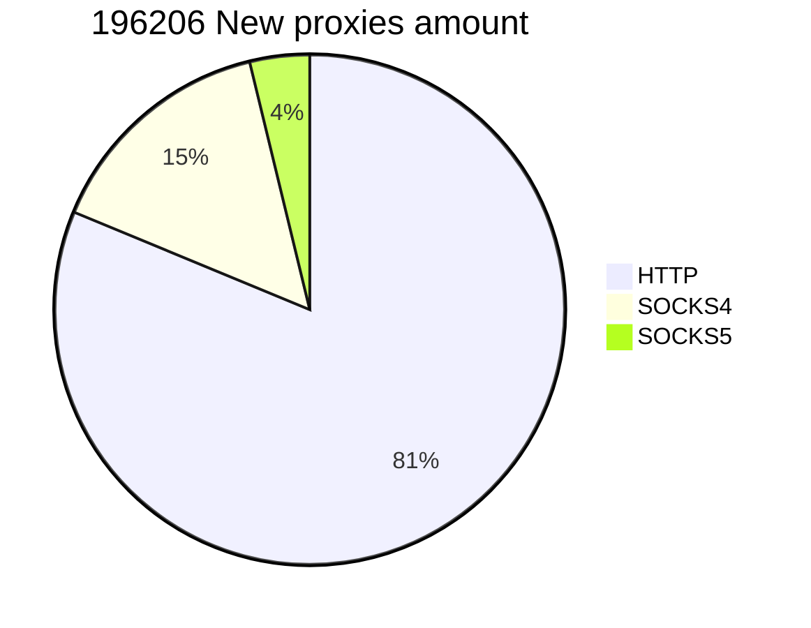

# Say "Fuck" to rate-limit. 🖕

> No need to scrape all the web, all is here.
>You can find the sources used in the file "sources.csv".
> If you want to add some, just make an issue or a git push.

        